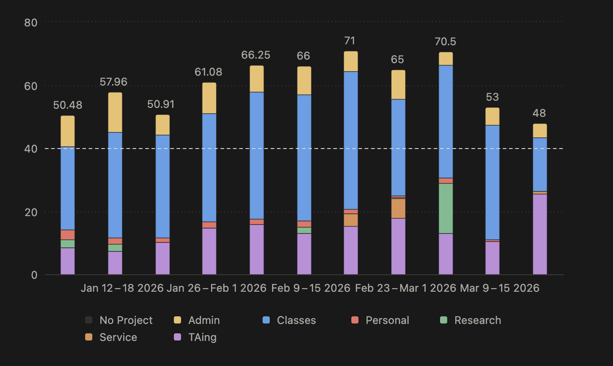
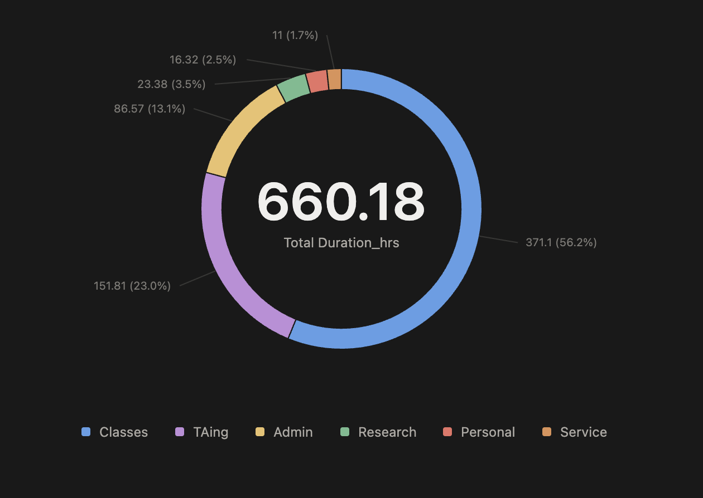
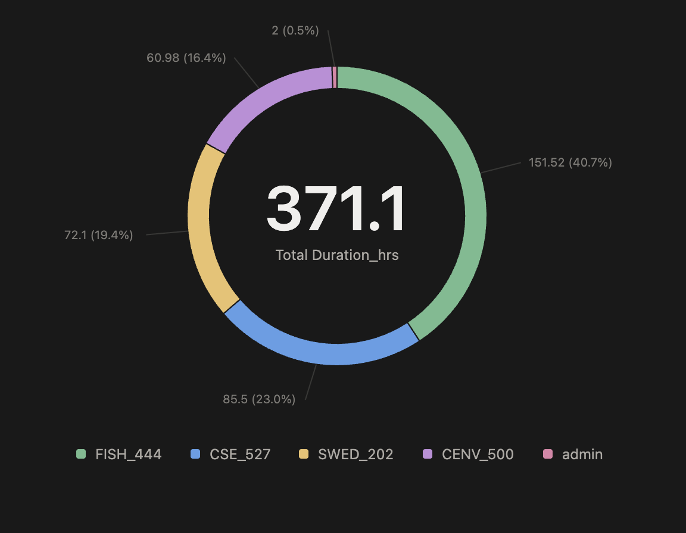

It's spring break, which means we've officially made it through the Winter 2026 quarter! This is particularly exciting for me because WI26 was a *very* class-heavy quarter for me. I took 17 graded credits, mostly because I finished out my MS credit requirements in preparation for bypassing. I also TA'd QSCI 381 again.

This quarter I switched to [Notion](https://brave-burst-39b.notion.site/kdurkin-dashboard) to keep track of my to-do items (assignments, TA tasks, meetings, etc.) and to keep a time log of how I spent my work hours.

## Quarter Summary

All in all this was a pretty rough quarter. I worked over 40 hours per week every week, usually *far* over. I'm pretty relieved to be done

The majority of my time was spent in class or completing classwork. If we break this down over the quarter's eleven weeks (10 weeks of classes, 1 week of finals), I worked 60 hours per week on average, and 56% of that (~34 hours per week) was spent on class stuff, followed by 23% of my time (~14 hours per week) on TAing. These stats are actually pretty good! Taking 17 credits of classes, the expectation is that I spend 51 credits per week on classwork (3 hours per credit, per week), and I was able to be far more efficient. Similarly, the expected maximum for TAing is 20 hours per week, and I didn't hit this limit. 

Unfortunately, I was able to dedicate almost no time to research this quarter (just 16 hours). The majority of this time was prepping for the Data Science seminar talk that Steven invited me to assist with. 

I took 4 classes this quarter: 

- SWED 202 (Swedish 202, 5 credits), which is a personally-motivated course; 
- CENV 500 (Communicating Science to the Public Effectively, 3 credits), which I was fortunate to be accepted into and took to improve presentation/communication skills; 
- CSE 527 (Computational Biology: Explainable AI in Biology & Biomedicine, 4 credits), which contributes to my MS credit requirements; 
- and FISH 444 (Conservation Genetics, 5 credits), which contributes to my MS credit requirements.

Of these 4 classes, FISH 444 took the most time by far -- 41% of my time working on class-related material was spent on FISH 444, an average of ~14 hours per week. My other 3 classes took roughly equal amounts of time (16.5% - 23% of my class time)

I did manage to get some non-class stuff done this quarter. As briefly mentioned, I co-gave a seminar talk for the Data Science group at UW with Steven, covering the eScience work from Fall 2026 (Timeseries data, working with Barnacle and the Elastic Net model). I've also been getting more involved with SEAS -- this quarter I officially joined the board and led another classroom lesson.

## Short-term Goals

In the coming weeks I need to get back on the research train. This quarter, I need to:

Degree stuff:

- finish incorporating Kerry's MS thesis proposal comments and get it back out to committee
- draft a PhD dissertation proposal, get committee comments, and incorporate
- finalize DDE draft and get it submitted somewhere
- finalize remaining bypass package materials

Other: 

- finalize and give CSE 500 public research talk
- register and source travel funding for ICRS this summer
- put together ICRS presentation

For the next ~2 weeks I'll focus on the mos time-sensitive: registering and applying for funding for ICRS; finalizing the CSE 500 talk (I have a practice run scheduled for April 2); and the MS thesis proposal.
