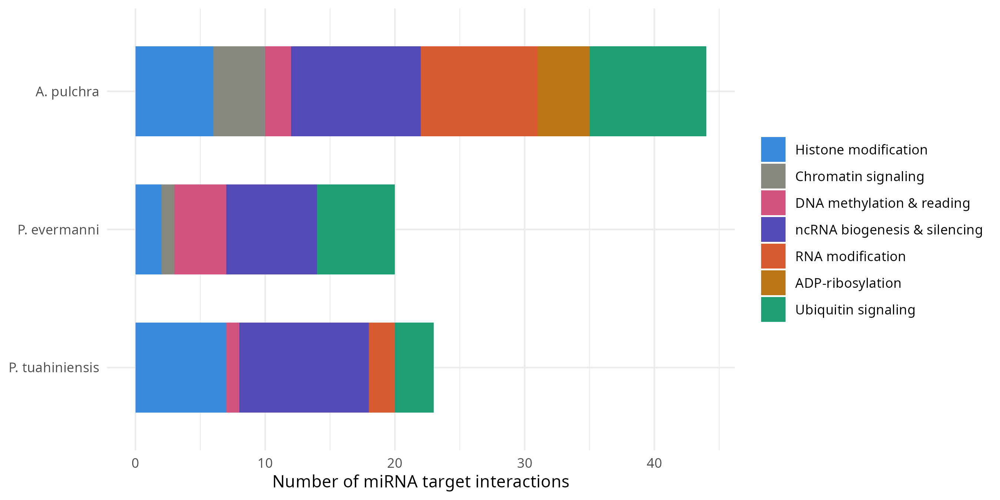

Finally finished with the epigenetic machinery analysis for the Deep Dive Expression manuscript!

After [compiling a list of \~90 proteins/genes](2026_04_10_DDE_ncRNA_machinery.qmd) involved in ncRNA biogenesis and function, and then [manually curating fastas](2026_04_13_DDE_ncRNA_machinery_fastas.qmd) (primarily cnidarian) for those proteins, I've now identified miRNA targets in all 3 of our study species that correspond to these ncRNA machinery proteins. I also searched for targets that match other epigenetic machinery (e.g., histone modifier, chromatin signaling, etc.), from an epigenetic machinery fasta compiled by Hollie/Steven.

Code for annotating ncRNA machinery in [A. pulchra](https://github.com/urol-e5/deep-dive-expression/blob/main/D-Apul/code/34-Apul-ncRNA-machinery-BLAST.md), [P. evermanni](https://github.com/urol-e5/deep-dive-expression/blob/main/E-Peve/code/32-Peve-ncRNA-machinery-BLAST.md), and [P. tuahiniensis](https://github.com/urol-e5/deep-dive-expression/blob/main/F-Ptuh/code/32-Ptuh-ncRNA-machinery-BLAST.md)

Code for [annotating miRNA targets in all 3 species](https://github.com/urol-e5/deep-dive-expression/blob/main/M-multi-species/code/12-miRNA-epimachinery.md) for both my curated ncRNA machinery and Hollie's epigenetic machinery.

## Results summary

Generally, the protein machinery that are putatively targeted by our coral miRNAs is extremely diverse, covering all major “branches” of epigenetic regulation:

### Histone Methylation

Covering demethylases (KDM3, KDM6, RIOX1), methyltransferases (KMT5A, KMT2E), acetyltransferases (KAT6A/B, KAT14, KAT2A/B), and deacetylases (HDAC4/5/7/9, SIRT7), plus arginine methylation (PRMT7)

### DNA Methylation & Reading

DNMT1 (maintenance methyltransferase), TET3 (active demethylation), MBD1/2/3 (methylation readers/NuRD recruitment), and PRDM14 (pluripotency-associated methylation regulator)

### ADP-Ribosylation (form of chromatin regulation)

Tankyrases (PARP5a/b), PARP7/TIPARP, macro-PARPs (PARP9/14/15), and the eraser ARH1

### Ubiquitin Signaling (form of protien modification)

Deubiquitinases (USPs, PSMD14, BAP1), E2/E3 ligases (UBE2D, UBE3A, CUL4A, DDB1, UBR2, RNF8, BRCA1)

### RNA Modification (Epitranscriptomics)

tRNA modifiers (TRMT1, TRMT61A/B, PUS7L, DUS1L), demethylases (ALKBH3), m6A reader (HNRNPA2B1), and ADAR (A-to-I editing)

### ncRNA Biogenesis & Silencing

Core RISC silencing complex (AGO1/2, TNRC6), biogenesis regulators (LIN28A, KHSRP, SRRT), Integrator complex (INTS1/4/6), RNA decay machinery (exosome, EDC4, CCR4-NOT, SMG1, PAN2), and chromatin/structural components (RBBP4, STAG1/2, SMARCA2/4, RDRP)

### Other Regulators

Signaling kinases (PKN1, MAP3K12, MAP2K1, Chuk/IKKα), phosphatases (PP1), and protein quality control (COPS6, Hspbap1)

### Plot

